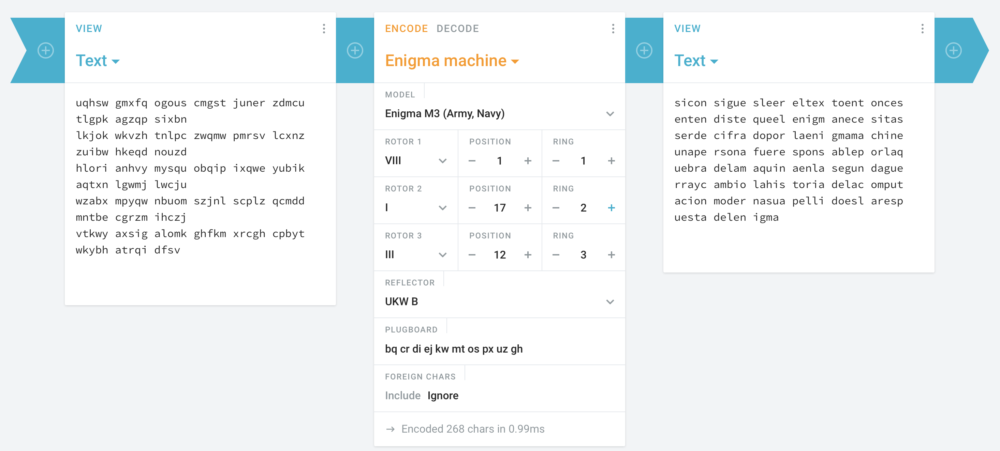

# Egypt

lospa ramet rospa rares olver son:

R1 = VIII / Pos = 1 / Ring = 1<br>
R2 = I / Pos = 17 / Ring = 2<br>
R3 = III / Pos = 12 / Ring = 3

```
uqhsw gmxfq ogous cmgst juner zdmcu tlgpk agzqp sixbn
lkjok wkvzh tnlpc zwqmw pmrsv lcxnz zuibw hkeqd nouzd
hlori anhvy mysqu obqip ixqwe yubik aqtxn lgwmj lwcju
wzabx mpyqw nbuom szjnl scplz qcmdd mntbe cgrzm ihczj
vtkwy axsig alomk ghfkm xrcgh cpbyt wkybh atrqi dfsv
```

## Solución

Usamos la máquina Enigma de https://cryptii.com:



con los parámetros que ofrece la letra:

* R1 = VIII / Pos = 1 / Ring = 1
* R2 = I / Pos = 17 / Ring = 2
* R3 = III / Pos = 12 / Ring = 3

## Respuesta

Turing

