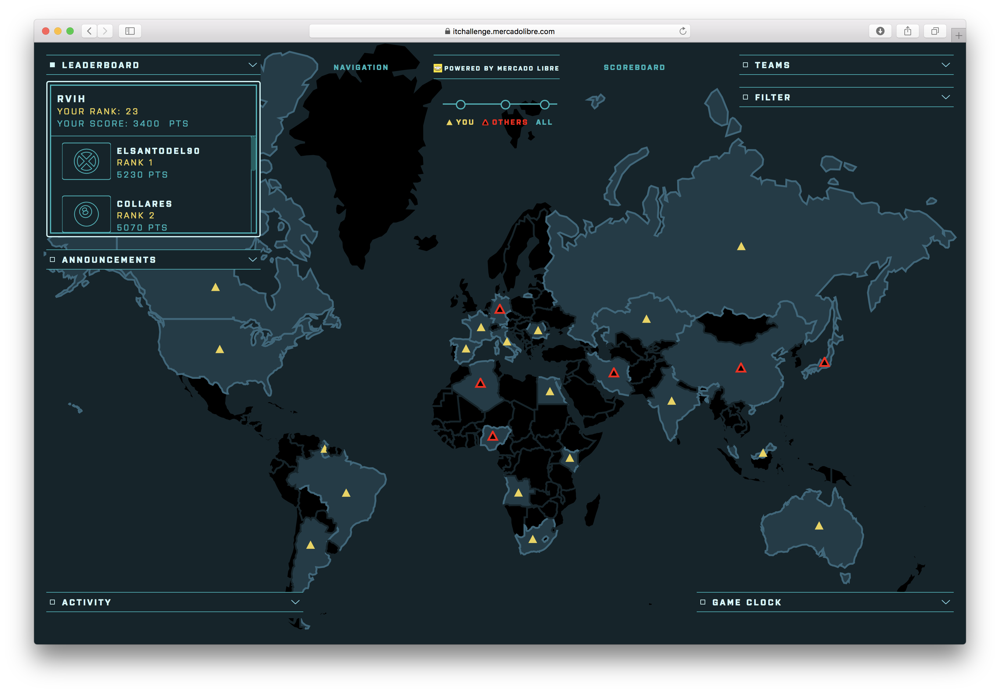

# MercadoLibre ItChallenge 2018

| País                                | Nombre                                        | Puntos | Solucionado  
| ------------------------------------|-----------------------------------------------|--------|--------------
| [🇩🇿 Algeria](Algeria)               | Unbiased Coin                                 | 350    | 
| [🇦🇴 Angola](Angola)                 | Lego Blocks                                   | 150    | ✅
| [🇦🇷 Argentina](Argentina)           | ALPACA                                        | 300    | ✅
| [🇦🇺 Australia](Australia)           | Py Parser                                     | 50     | ✅
| [🇧🇷 Brazil](Brazil)                 | DECORANDO                                     | 150    | ✅
| [🇨🇦 Canada](Canada)                 | IMAGEN INDESCIFRABLE                          | 450    | ✅
| [🇨🇳 China](China)                   | BIRDPLANE                                     | 550    | 
| [🇪🇬 Egypt](Egypt)                   | ENIGMA                                        | 150    | ✅
| [🇫🇷 France](France)                 | Balanced Strings                              | 50     | ✅
| [🇩🇪 Germany](Germany)               | Cuadrado no tan mágico                        | 150    | 
| [🇬🇾 Guyana](Guyana)                 | Ximena, Oscar y Raúl                          | 250    | ✅
| [🇮🇳 India](India)                   | Substring Calculator                          | 150    | ✅
| [🇮🇷 Iran](Iran)                     | Gotta Catch 'Em All!                          | 500    | 
| [🇮🇹 Italy](Italy)                   | The Perfect Team                              | 50     | ✅
| [🇯🇵 Japan](Japan)                   | Moraleja: no implementar tu propia hash table | 300    | 
| [🇰🇿 Kazakhstan](Kazakhstan)         | Giant Roulette                                | 300    | ✅
| [🇰🇪 Kenya](Kenya)                   | MEDAL                                         | 50     | ✅
| [🇲🇾 Malasya](Malasya)               | HRML Parser                                   | 150    | ✅
| [🇳🇬 Nigeria](Nigeria)               | Mensaje Chino                                 | 350    | 
| [🇷🇴 Romania](Romania)               | BROKEN RSA                                    | 350    | ✅
| [🇷🇺 Russia](Russia)                 | WIFI                                          | 300    | ✅
| [🇿🇦 South Africa](South%20Africa)   | GHOST AUDIO                                   | 400    | ✅
| [🇪🇸 Spain](Spain)                   | PAGES                                         | 50     | ✅
| [🇺🇸 United States](United%20States)&nbsp;&nbsp;&nbsp;&nbsp;&nbsp;&nbsp;&nbsp;&nbsp;&nbsp;&nbsp;&nbsp;&nbsp;&nbsp;&nbsp;&nbsp;&nbsp;&nbsp;&nbsp;&nbsp;&nbsp;&nbsp;&nbsp;&nbsp;&nbsp;&nbsp;&nbsp;&nbsp;&nbsp;&nbsp;&nbsp;&nbsp;&nbsp;&nbsp;&nbsp;&nbsp;&nbsp;&nbsp;&nbsp;&nbsp;&nbsp;&nbsp; | Username Disparity                            | 50     | ✅

> ✅ Solucionado durante la competencia  
> ✔️ Solucionado luego de la competencia